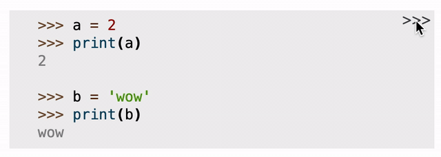
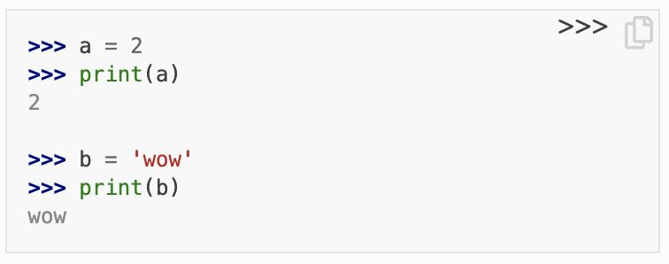

# sphinx-toggleprompt

  [](https://pypi.org/project/sphinx-toggleprompt/) 
| [](https://sphinx-toggleprompt.readthedocs.io/en/stable/?badge=stable)
| [](https://github.com/jurasofish/sphinx-toggleprompt/actions)


``Sphinx-toggleprompt`` adds a button to Python code blocks to
toggle ``>>>`` prompts and remove output lines. It's copied
from the official Python docs theme.

See [the documentation](https://sphinx-toggleprompt.readthedocs.io/en/master/).



## Installation and Usage

You can install `sphinx-toggleprompt` with `pip`:

```
pip install sphinx-toggleprompt
```

In your `conf.py` configuration file, add `sphinx_toggleprompt` to your extensions list.

```
extensions = [
    ...
    'sphinx_toggleprompt',
    ...
]
```

## Usage with ``sphinx-copybutton``

``sphinx-toggleprompt`` works well with ``sphinx-copybutton`` - see 
[the documentation](https://sphinx-toggleprompt.readthedocs.io/en/master/).


