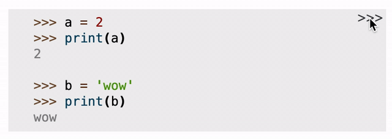

======================
Sphinx-toggleprompt
======================

.. image:: https://img.shields.io/pypi/v/sphinx-toggleprompt.svg
    :target: https://pypi.org/project/sphinx-toggleprompt/

.. image:: https://readthedocs.org/projects/sphinx-toggleprompt/badge/?version=stable
    :target: https://sphinx-toggleprompt.readthedocs.io/en/stable/?badge=stable
    :alt: Documentation Status

.. image:: https://github.com/jurasofish/sphinx-toggleprompt/workflows/build/badge.svg?branch=master
    :target: https://github.com/jurasofish/sphinx-toggleprompt/actions

.. |br| raw:: html

   

|br|

``Sphinx-toggleprompt`` adds a button to Python code blocks to
toggle ``>>>`` prompts and remove output lines. It's copied
from the official Python docs theme.

.. code-block:: python

    >>> a = 2
    >>> print(a)
    2
    
    >>> b = ['wow',
    ...      'eee']
    >>> print(b)
    ['wow', 'eee']

|

.. ipython:: python

    # It works with IPython too
    cloud_vars = ['total_clouds', 'low_clouds',
                  'mid_clouds', 'high_clouds']
    print(sorted(cloud_vars))
    cloud_vars

|

.. ipython:: python

    # It works with IPython too
    cloud_vars = ['total_clouds', 'low_clouds',
                  'mid_clouds', 'high_clouds']
    print(sorted(cloud_vars))

It only adds itself to Python code which contains prompts.

.. code-block:: text

    This is formatted as plain text,
    so it doesn't get the toggle button.

|

.. code-block:: python

    msg = 'This is python, but no lines start with >>>'
    print(msg)

This extension is heavily based on `sphinx-copybutton
<https://github.com/executablebooks/sphinx-copybutton>`_ - thanks!

Installation
==============

``sphinx-toggleprompt`` is available on pypi through ``pip``, or you can
alternatively install directly from github.

.. code-block:: bash

   pip install sphinx-toggleprompt

Usage
============

Add ``sphinx-toggleprompt`` to your sphinx extensions list in ``conf.py``
and then build your docs - that's it.

.. code-block:: python

   extensions = [
       ...
       'sphinx_toggleprompt',
       ...
   ]

Configuration
================

You can control the offset of the toggleprompt button from the right-hand
side of the code cell in pixels with the ``toggleprompt_offset_right``
config value.
The default is zero (all the way to the right).
Simply add ``toggleprompt_offset_right`` to your sphinx ``conf.py``:

.. code-block:: python

    # In your sphinx conf.py
    # Defaults to 0 if not provided.
    toggleprompt_offset_right = 35

Themes
=======

``sphinx-toggleprompt`` has been tested with the Alabaster theme
(sphinx's default) and with the read the docs theme.

Using with sphinx-copybutton
================================

``sphinx-toggleprompt`` works great with `sphinx-copybutton
<https://github.com/executablebooks/sphinx-copybutton>`_ - just simply
add both of them to the extensions list in ``conf.py``.
Setting ``toggleprompt_offset_right`` to a value around 35 stops them
from overlapping (will probably vary).
There's an example of this in the doc_copybutton folder.

.. image:: _static/with_copybutton.png
   :width: 500px

Changelog
================================

Vx.x.x - unreleased
-----------------------

- Added tests for python 3.6 through 3.8
- Added tests for sphinx 4
- Restricted jinja2 dependency version to fix breaking changes introduced in version 3.1

V0.0.5 - 27-Nov-2020
-----------------------

- Add IPython highlighting support

V0.0.3 - 25-jul-2020
-----------------------

- Make the ">>>" text non-selectable

V0.0.2 - 17-may-2020
-----------------------

- Initial release
